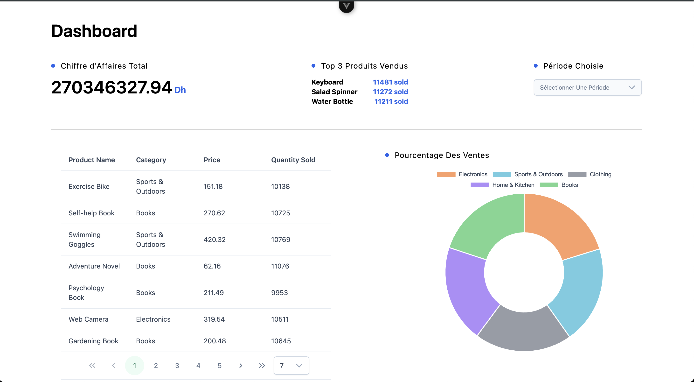
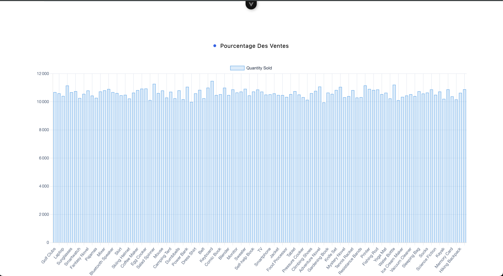

# Node.js & Vue.js Dashboard Implementation

## Introduction

Hello,  
I am **Nacereddine Chouich**, a Full Stack Developer with a keen interest in innovative and impactful projects.  
Feel free to reach out to me via:

- **Email**: [nacreddinechouich0012@gmail.com](mailto:nacreddinechouich0012@gmail.com)
- **LinkedIn**: [https://www.linkedin.com/in/nacreddine-chouich/](https://www.linkedin.com/in/nacreddine-chouich/)
- **Phone**: +212-6-93-90-12-60

This project is a **simple Node.js and Vue.js dashboard implementation**, created as part of a **technical job test**. It demonstrates my ability to build a structured, functional, and visually appealing solution for analyzing e-commerce data.

---

## About the Project: Simplified E-Commerce Basket Analysis Tool

This tool simulates a real-world scenario in which an administrator of an e-commerce platform can analyze sales trends and visualize key metrics. It includes a **Vue 3 frontend** and a **Node.js + TypeScript backend**, and is designed to meet the following objectives:

### Features

1. **Frontend (Vue.js)**:

   - **Dashboard**:
     - Total Sales: Displays the sum of sales within a selected time period.
     - Trending Products: Highlights the top 5 best-sellers by quantity.
     - Category Sales: Shows sales percentages per category.
     - Product Table: Lists products with details like name, date added, price, and total sales.
   - **Visualizations**:
     - Bar charts and pie charts for category sales.
     - Histograms for product sales trends.
   - **Filters**:
     - Dropdown to select time ranges: Last 7 days, last 30 days, or last 12 months.

2. **Backend (Node.js)**:

   - RESTful API Endpoints:
     - `/analytics/total_sales`: Fetch total sales for a selected period.
     - `/analytics/trending_products`: Retrieve the top 3 best-selling products.
     - `/analytics/category_sales`: Provide sales distribution by category.
     - `/products`: List all products with their sales data.
   - **Data Processing**:
     - Aggregates sales data to calculate totals and percentages.
     - Performs sales metric computations.

3. **Database**:
   - Utilizes **MongoDB** with preloaded data for products and sales.

---

## Getting Started

### Prerequisites

- Node.js (v20+)
- MongoDB
- Vue
- npm or yarn

### Installation

1. Clone the repository:

   ```bash
   git clone https://github.com/Chouich-Nacereddine/Job-Test.git
   ```

2. Install packages:

   ```bash
    cd server
    npm i
    cd ../world-of-numeric-Job-test-nacereddine-chouich
    npm i
   ```

3. Create .env file ./server/.env this file shoold containe two variables:

   ```.env
    MONGO_URI=xxxxxx
    PORT=yyyy
   ```

   Replace xxxxxx with your mongodb connection uri
   Replace yyyy with the port the server will be listening on or it will be by default 5000

4. Run the project:
   ```bash
   cd server
   npm start
   ```
   ```bash
   cd ../world-of-numeric-Job-test-nacereddine-chouich
   npm run dev
   ```

### Open Browser: http://localhost:5173/




#### The default selected period is the last year '365 day'

#### Check this Tutorial

Here’s a demonstration of the application:
[Video](https://drive.google.com/file/d/1QZMandp2r5wJwpEaOeDovb9tnMaO0Qvb/view?usp=sharing)

## API Endpoints

### GET /analytics/total_sales

- **Description**: Returns the total sales amount for the selected period.

---

### GET /analytics/trending_products

- **Description**: Returns a list of the top 3 best-selling products, including:
  - Product name
  - Quantity sold
  - Total sales amount for each product
- **Example**
  - {
    "trendingProducts": [
    {
    "productName": "Keyboard",
    "totalQuantity": 11481,
    "totalSales": 2920954.67
    },
    {
    "productName": "Salad Spinner",
    "totalQuantity": 11272,
    "totalSales": 2951221.71
    },
    ]}

---

### GET /analytics/category_sales

- **Description**: Returns the sales distribution by category, including:
  - Category
  - Quantity sold
  - Percentage of total sales by Category
- **Example**
  - {
    "categorySales": [
    {
    "category": "Electronics",
    "totalQuantity": 214403,
    "categoryPercentage": "20.19"
    },
    {
    "category": "Sports & Outdoors",
    "totalQuantity": 212556,
    "categoryPercentage": "20.02"
    }
    ]}

---

### GET /products

- **Description**: Returns a table of products with:
  - The name of each product
  - The total number of sales for each product
  - **Example**
  - {"products": [
    {
    "ProductID": "93",
    "ProductName": "Fishing Rod",
    "Category": "Sports & Outdoors",
    "Price": "104.04",
    "QuantitySold": 10868,
    "TotalAmountSold": {
    "$numberDecimal": "2695422.38"
    }
    },
    {
    "ProductID": "32",
    "ProductName": "Jeans",
    "Category": "Clothing",
    "Price": "286.23",
    "QuantitySold": 10234,
    "TotalAmountSold": {
    "$numberDecimal": "2621201.90"
    }
    }]}

---
